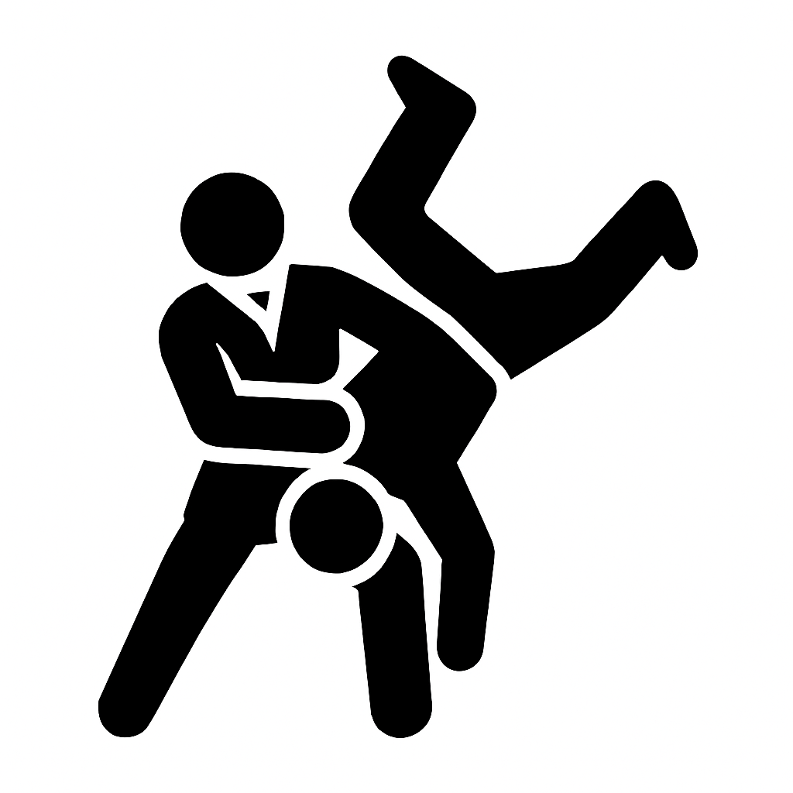
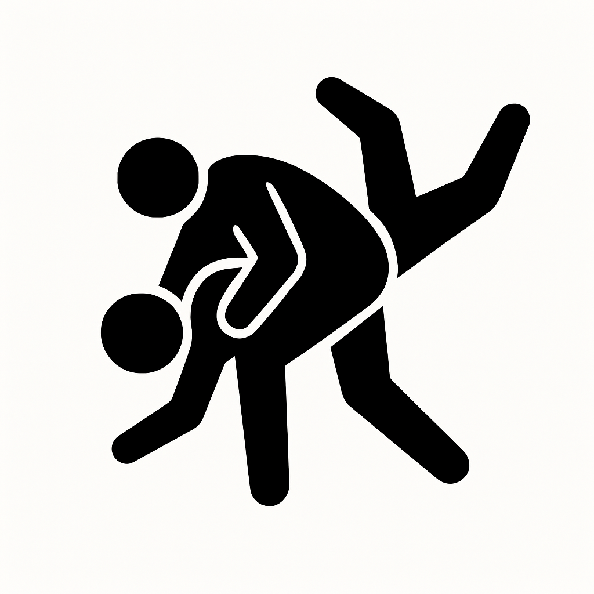
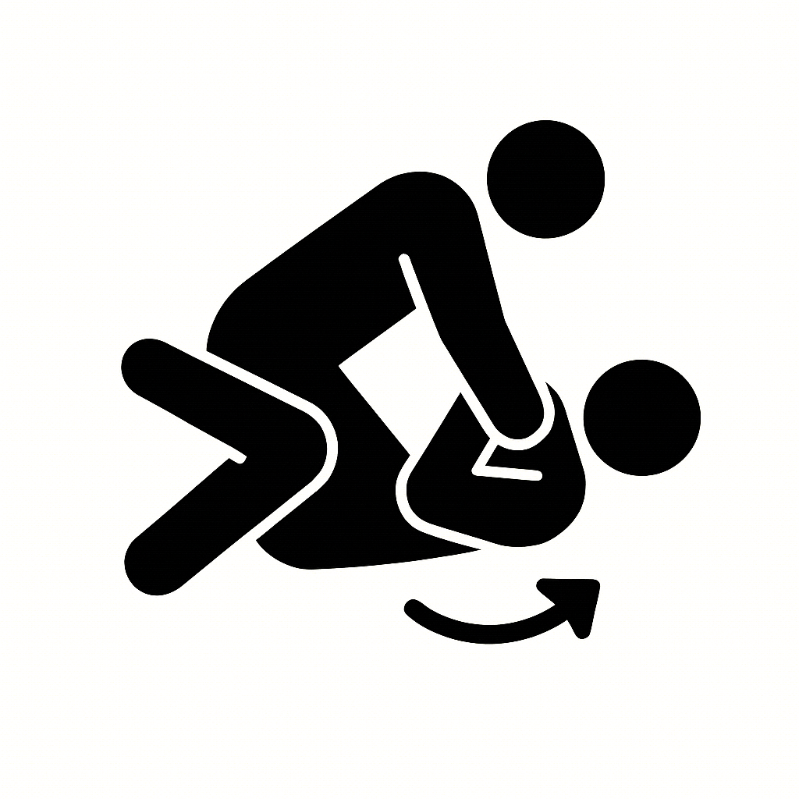
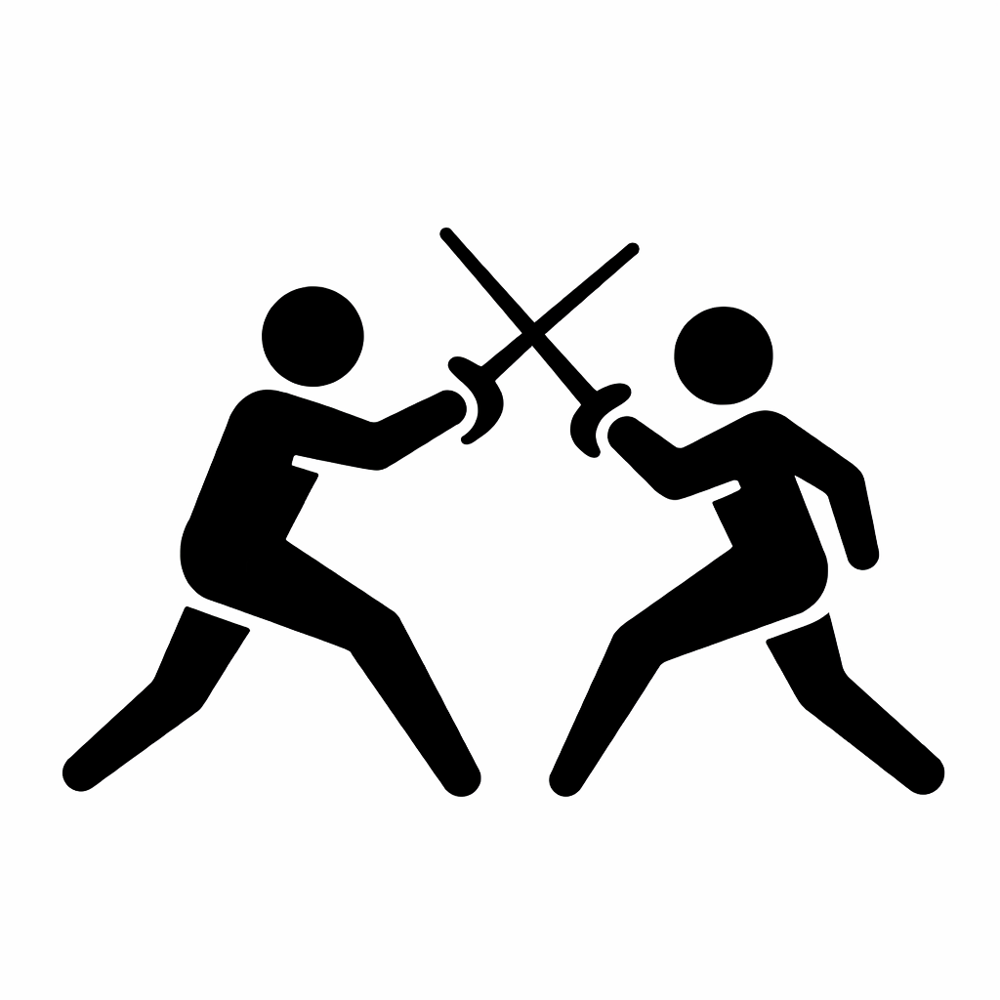

# Fight Encyclopedia

### The World's First Unified Taxonomy of Fighting Techniques

[**fightencyclopedia.com**](https://fightencyclopedia.com)

**English** | [日本語](README.ja.md) | [Portugues](README.pt.md)

---

**Fight Encyclopedia** is a comprehensive, structured knowledge base cataloging fighting techniques across **all martial arts and combat sports** into a single, scientifically organized taxonomy.

Think of it as **Wikipedia meets a biological classification system** — but for fighting techniques.

<br>

## By the Numbers

| | |
|---|---|
| **1,616+** | Techniques documented |
| **183** | Martial arts covered |
| **9** | Technique classes |
| **7** | Taxonomy levels |
| **925+** | Verified reference sources |
| **2,000+** | Free martial arts books |
| **43** | Data fields per technique |
| **10+** | Languages in reference database |

<br>

## The 9 Technique Classes

<table>
<tr>
<td align="center" width="33%"><br><b>Submission</b><br><sub>Chokes, joint locks, compression</sub></td>
<td align="center" width="33%"><br><b>Strike</b><br><sub>Punches, kicks, elbows, knees</sub></td>
<td align="center" width="33%"><br><b>Throw</b><br><sub>Hip throws, sacrifice throws</sub></td>
</tr>
<tr>
<td align="center"><br><b>Takedown</b><br><sub>Single legs, double legs, trips</sub></td>
<td align="center"><br><b>Clinch</b><br><sub>Tie-ups, frames, clinch control</sub></td>
<td align="center"><br><b>Position</b><br><sub>Guards, mounts, back control</sub></td>
</tr>
<tr>
<td align="center"><br><b>Escape & Reversal</b><br><sub>Escapes, sweeps, reversals</sub></td>
<td align="center"><br><b>Defence</b><br><sub>Blocks, parries, counters</sub></td>
<td align="center"><br><b>Weapon</b><br><sub>Sword, staff, knife, traditional</sub></td>
</tr>
</table>

<br>

## The 7-Level Taxonomy

Every technique is classified using a **biological-style hierarchy** with 7 levels:

```
Class
 └── Group
      └── Family
           └── SubFamily
                └── Genus
                     └── Species
                          └── Variety
```

**Example path:**
```
Submission > Choke & Strangle Lock > Leg Choke > Triangular Strangle
  > Triangle Choke > Triangle From Closed Guard > Standard Triangle
```

This structure allows precise classification while showing relationships between techniques across different martial arts.

<br>

## 43 Data Fields Per Technique

Every technique entry contains up to **43 structured fields** organized into 9 categories:

| Category | Fields | Examples |
|---|---|---|
| **Identity** | entityName, japaneseName, translation, aliases | "Omoplata", "足三角絡み", "Ashi-Sankaku-Garami" |
| **Technical** | biomechanicalMechanism, positionEntryExamples, variants, commonMistakes | Joint angles, force vectors, leverage principles |
| **Ratings** | dangerRating, difficulty, legalityInCompetition | "8/10", "Intermediate", "IBJJF: Legal" |
| **Historical** | historyOrigin, effectiveness, competitionRecord | Origins, notable uses, championship finishes |
| **References** | references, referenceUrls, referencePages, referenceNotes | Books, papers, competition data with citations |
| **Academic** | primarySource, lineage, peerReview, lastVerified | Source attribution and verification chain |
| **Fighter Data** | physicalAttributes, counterTechniques, setupChain | "Requires: hip flexibility", counter and chain links |
| **Taxonomy** | class, group, family, subFamily, genus, species, variety | Full 7-level classification |
| **Japanese** | japaneseName, englishJapaneseName, nameOrigin | Kanji, romanization, traditional/gairaigo origin |

<br>

## Martial Arts Covered

Fight Encyclopedia covers **183 martial arts** across 4 types:

- **Striking** (66): Boxing, Muay Thai, Karate, Taekwondo, Kickboxing, Savate, Wing Chun, and more
- **Grappling** (42): BJJ, Judo, Wrestling, Sambo, Catch Wrestling, Sumo, and more
- **Hybrid** (25): MMA, Krav Maga, JKD, Pankration, Pencak Silat, and more
- **Weapon-Based** (50): Kendo, Fencing, HEMA, Escrima, Iaido, and more

<br>

## Reference Database

**925+ verified sources** across 12 categories:

1. Sport Academies (97 institutions, 33 countries)
2. Federations & Governing Bodies (77 entries)
3. Research Papers & Journals (24 journals, 18 landmark papers)
4. Textbooks & Books (132 books in 10+ languages)
5. Video Archives & Channels (62 entries)
6. Historical Archives & Museums (42 entries)
7. Competition Rule Sets (30 rule sets, 16 sports)
8. Biomechanics & Sports Science (68 entries)
9. Traditional Lineages (28 lineage trees)
10. Training Methodologies (95 entries)
11. Medical & Injury Research (88 entries)
12. Notable Practitioners & Masters (152 entries)

Plus **8,822 Russian-language martial arts books** cataloged from the Russian National Library.

<br>

## Digital Library

**2,000+ free martial arts books** from Internet Archive and Project Gutenberg with:
- Custom in-browser reader with page tracking
- Reading progress and bookmarks
- Community ratings (5-star system)
- Books across Boxing, BJJ, Judo, Karate, Wrestling, Fencing, and more

<br>

## Fight IQ

**Chess-style martial arts puzzles** — the first of their kind:

- Find the correct technique sequence to reach a submission (like chess tactics)
- Elo rating system that adapts to your skill level
- Daily puzzles with streak tracking
- **14 interactive lessons** teaching technique chains through narrated scenarios
- XP and belt rank progression

No product like this exists in the market.

<br>

## Tech Stack

- **Next.js 15** + React 19
- **PostgreSQL** + Drizzle ORM + pgvector
- **tRPC** (type-safe API)
- **Hybrid search**: keyword (tsvector + trigram) + semantic (384-dim embeddings)
- **Tailwind CSS**
- **Turborepo** monorepo

<br>

## We're Looking for Contributors

Fight Encyclopedia is built by **ACENji Tech Solutions Inc.** We're looking for pro bono contributors:

| Role | Need | Ideal For |
|---|---|---|
| **Martial Arts Researcher** | 2-3 people | BJJ/MMA/Judo practitioners, martial arts bloggers |
| **Taxonomy Editor** | 1 person | Librarians, biologists, Wikipedia editors |
| **Content Writer** | 2-3 people | Martial arts journalists, sports science students |
| **Translator** | 3-5 people | Japanese, Chinese, Russian, Portuguese, Korean speakers |
| **Developer** | 1-2 people | Full-stack (Next.js, React, PostgreSQL) |
| **Video Contributor** | 5+ people | Anyone who watches martial arts on YouTube |
| **Game Developer** | 1 person | For Fight IQ puzzles and interactive features |

**Apply:** [fightencyclopedia.com/contribute](https://fightencyclopedia.com/contribute)

<br>

## Links

- **Website:** [fightencyclopedia.com](https://fightencyclopedia.com)
- **Techniques A-Z:** [fightencyclopedia.com/techniques/a-z](https://fightencyclopedia.com/techniques/a-z)
- **Martial Arts A-Z:** [fightencyclopedia.com/martial-arts/a-z](https://fightencyclopedia.com/martial-arts/a-z)
- **Fight IQ:** [fightencyclopedia.com/fight-iq](https://fightencyclopedia.com/fight-iq)
- **Library:** [fightencyclopedia.com/library](https://fightencyclopedia.com/library)
- **Contact:** [info@fightencyclopedia.com](mailto:info@fightencyclopedia.com)
- **LLMs.txt:** [fightencyclopedia.com/llms.txt](https://fightencyclopedia.com/llms.txt)

<br>

## License

MIT License — see [LICENSE](LICENSE) for details.

The technique taxonomy data and reference database are proprietary to ACENji Tech Solutions Inc. This repository contains documentation and structural information only.

<br>

---

<p align="center">
  <strong>Built by <a href="https://acenji.com">ACENji Tech Solutions Inc.</a></strong><br>
  Delaware, USA
</p>
