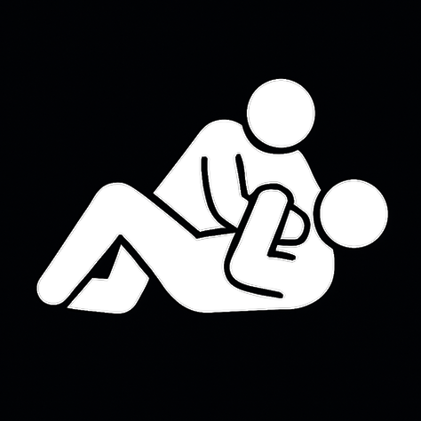
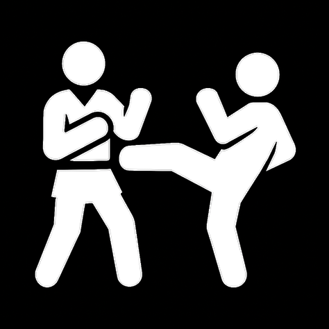
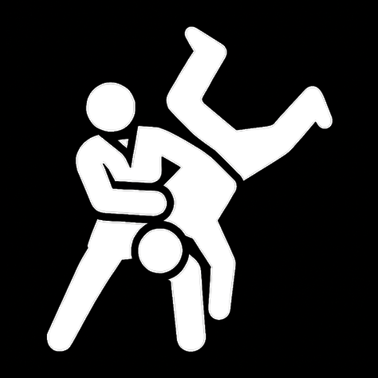
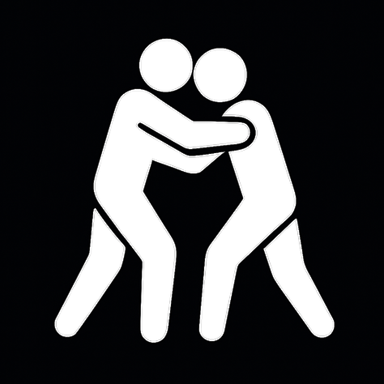
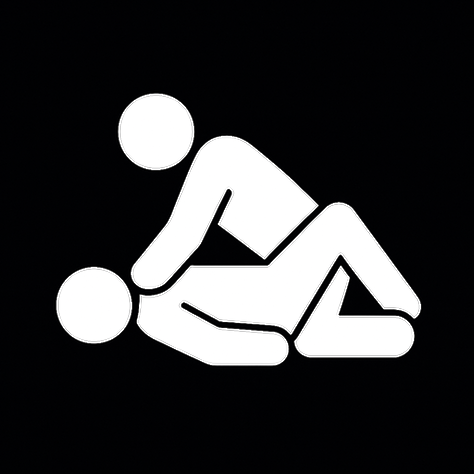
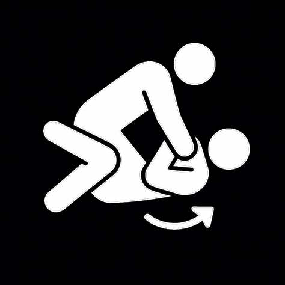
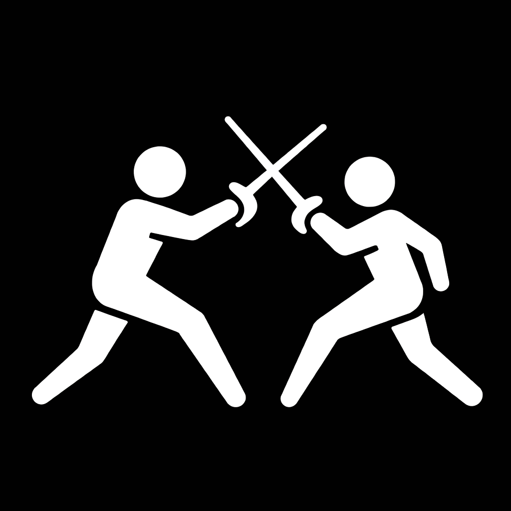
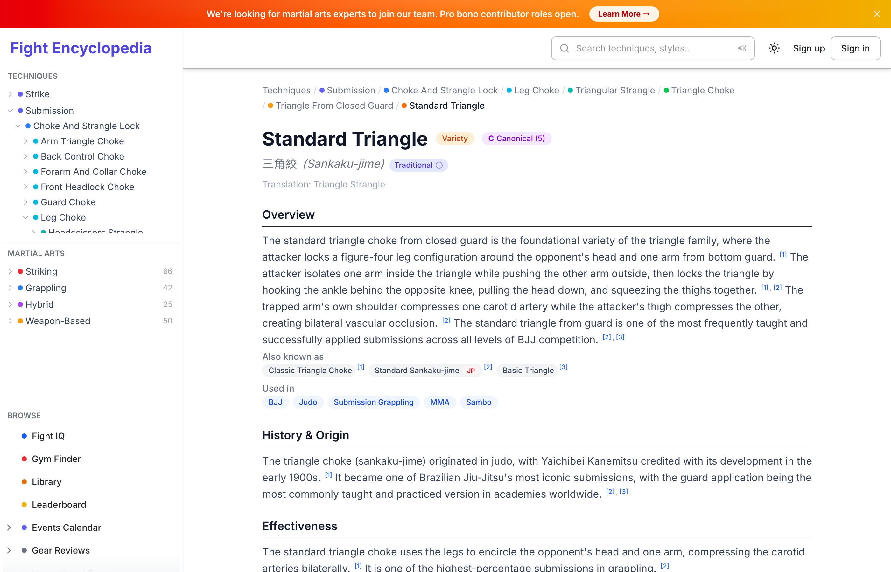
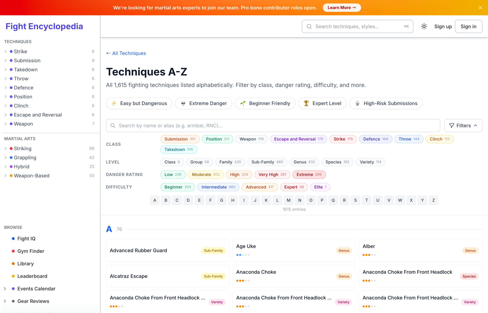
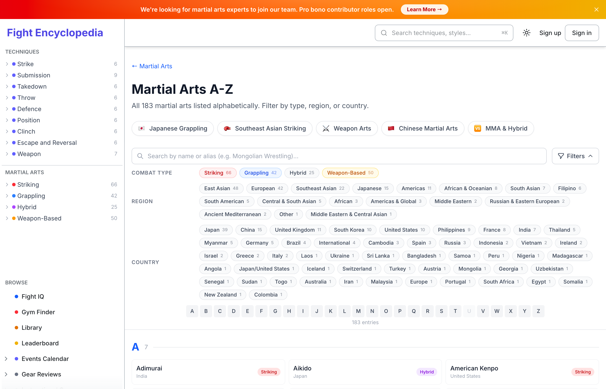

<p align="center">
  
</p>

<h1 align="center">Fight Encyclopedia</h1>

<p align="center">
  <strong>Первая в мире единая таксономия боевых техник</strong>
</p>

<p align="center">
  <a href="https://fightencyclopedia.com"></a>
  
  
  
  
</p>

<p align="center">
  <a href="README.md">English</a> | <a href="README.ja.md">日本語</a> | <a href="README.pt.md">Português</a> | <a href="README.bg.md">Български</a> | <strong>Русский</strong> | <a href="README.es.md">Español</a> | <a href="README.fr.md">Français</a> | <a href="README.zh.md">中文</a>
</p>

---

## Проблема

Сотни боевых искусств имеют техники, существующие **только в устной традиции** — передаваемые от учителя к ученику без письменных записей. Если их не задокументировать, они будут утрачены.

Существующие ресурсы **фрагментированы**: техники BJJ на одном сайте, дзюдо на другом, ударные техники на третьем. Один и тот же рычаг руки существует в BJJ, дзюдо, самбо и MMA — но документируется отдельно в каждом, без связи между ними.

**Ни один ресурс не охватывает все боевые техники всех искусств в единой системе.**

До сих пор.

## Что мы создали

**Fight Encyclopedia** каталогизирует боевые техники из **всех боевых искусств и единоборств** в единую, научно организованную таксономию — как биологическая система классификации для боевых искусств.

Каждая техника документирована с биомеханическим анализом, японскими названиями, рейтингом опасности, легальностью на соревнованиях, проверенными источниками, контрприёмами и цепочками подготовки.

<br>

<table>
<tr>
<td align="center"><b>1,616+</b><br><sub>Техник</sub></td>
<td align="center"><b>183</b><br><sub>Боевых искусств</sub></td>
<td align="center"><b>9</b><br><sub>Классов</sub></td>
<td align="center"><b>7</b><br><sub>Уровней</sub></td>
<td align="center"><b>43</b><br><sub>Полей/Техника</sub></td>
<td align="center"><b>925+</b><br><sub>Источников</sub></td>
<td align="center"><b>2,000+</b><br><sub>Бесплатных книг</sub></td>
</tr>
</table>

<br>

<table>
<tr>
<td align="center" width="33%"><br><b>Сабмишн</b><br><sub>335 техник — Удушения, болевые, компрессии</sub></td>
<td align="center" width="33%"><br><b>Удар</b><br><sub>175 техник — Кулаки, удары ногами, локти, колени</sub></td>
<td align="center" width="33%"><br><b>Бросок</b><br><sub>138 техник — Броски через бедро, жертвенные броски</sub></td>
</tr>
<tr>
<td align="center" width="33%"><br><b>Тейкдаун</b><br><sub>100 техник — Проходы в ноги, подсечки</sub></td>
<td align="center" width="33%"><br><b>Клинч</b><br><sub>111 техник — Захваты, рамки, контроль</sub></td>
<td align="center" width="33%"><br><b>Позиция</b><br><sub>149 техник — Гарды, маунт, контроль спины</sub></td>
</tr>
<tr>
<td align="center" width="33%"><br><b>Уход и разворот</b><br><sub>156 техник — Уходы, свипы, развороты</sub></td>
<td align="center" width="33%"><br><b>Защита</b><br><sub>164 техник — Блоки, парирования, контратаки</sub></td>
<td align="center" width="33%"><br><b>Оружие</b><br><sub>176 техник — Меч, посох, нож</sub></td>
</tr>
</table>

<br>

## Посмотрите в действии

**Страница техники** — полная глубина данных для каждой техники:



<br>

**Техники A-Z** — просмотр и фильтрация всех 1,616 техник:



<br>

**Боевые искусства A-Z** — 183 боевых искусства с фильтрами:



<br>

**Цифровая библиотека** — 2,000+ бесплатных книг:


<br>

## 7-уровневая таксономия

Каждая техника классифицирована с помощью **биологической иерархии** — от широкого класса до конкретной разновидности:

```
Класс ─── Группа ─── Семейство ─── Подсемейство ─── Род ─── Вид ─── Разновидность
```

> **[7-уровневая таксономия →](TAXONOMY.md)**

<br>

## 183 боевых искусства

| | | |
|---|---|---|
| **Ударные** | 66 | |
| **Борьба** | 42 | |
| **Гибридные** | 25 | |
| **Оружейные** | 50 | |

<br>

## Fight IQ — Шахматы для боевых искусств

**Первая игра-головоломка по боевым искусствам.** Аналогов не существует.

> **[Fight IQ →](https://fightencyclopedia.com/fight-iq)**

<br>

## Цифровая библиотека

**2,000+ бесплатных книг по боевым искусствам** с пользовательским ридером, отслеживанием страниц, закладками и рейтингами сообщества.

> **[Цифровая библиотека →](https://fightencyclopedia.com/library)**

<br>

## База данных источников

**925+ проверенных источников** в 12 категориях — без непроверенных утверждений в энциклопедии.

<br>

## Ищем участников

<table>
<tr>
<td>🥋 <b>Исследователь боевых искусств</b><br><sub>2-3 человека — Практикующие</sub></td>
<td>📚 <b>Редактор таксономии</b><br><sub>1 человек — Библиотекари, биологи</sub></td>
<td>✍️ <b>Автор контента</b><br><sub>2-3 человека — Журналисты, научные авторы</sub></td>
</tr>
<tr>
<td>🌐 <b>Переводчик</b><br><sub>3-5 человек — Носители русского языка приветствуются!</sub></td>
<td>💻 <b>Разработчик</b><br><sub>1-2 человека — Next.js, React, PostgreSQL</sub></td>
<td>🎮 <b>Разработчик игр</b><br><sub>1 человек — Fight IQ головоломки</sub></td>
</tr>
<tr>
<td>🎥 <b>Видеоконтрибьютор</b><br><sub>5+ человек</sub></td>
</tr>
<tr>
<td colspan="3">
  <b><a href="https://fightencyclopedia.com/contribute">Подать заявку →</a></b>
</td>
</tr>
</table>

<br>

## License

MIT License — [LICENSE](LICENSE)

> Данные таксономии техник, база данных источников и код платформы являются собственностью ACENji Tech Solutions Inc. Этот репозиторий содержит только документацию, структурную информацию и визуальные материалы.

---

<p align="center">
  <sub>Built with ❤️ by <a href="https://acenji.com"><b>ACENji Tech Solutions Inc.</b></a> · Delaware, USA</sub>
</p>
